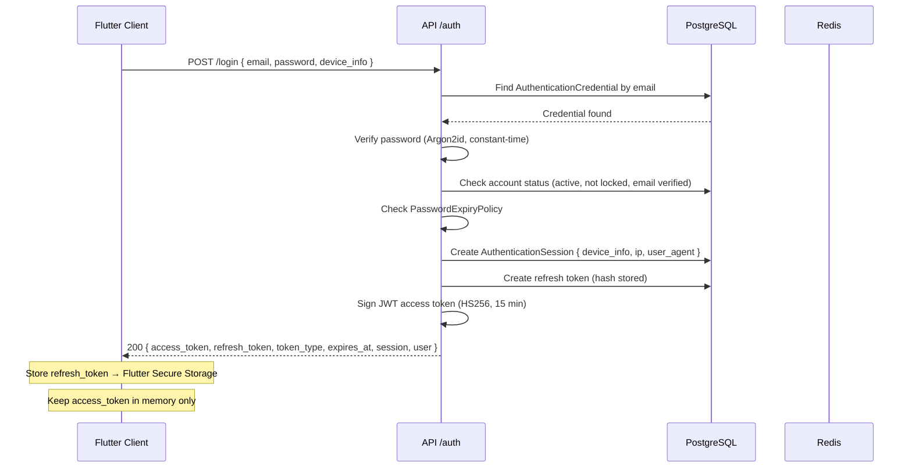
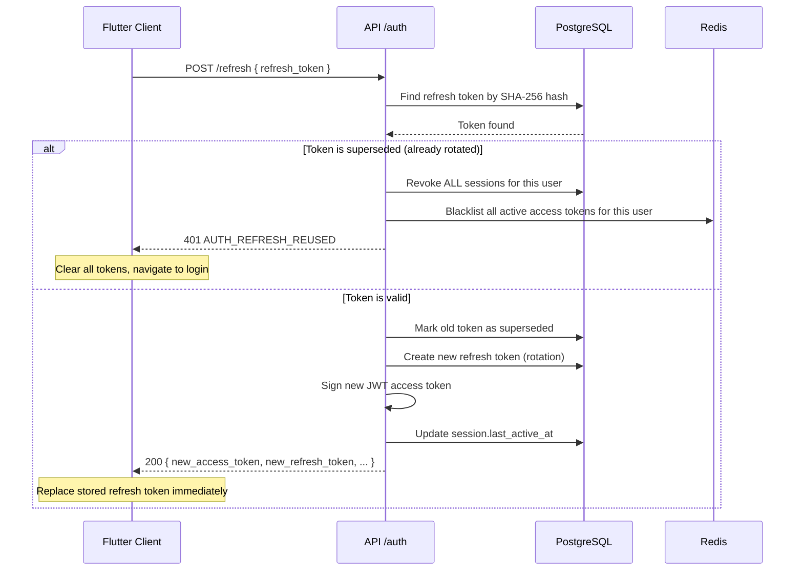
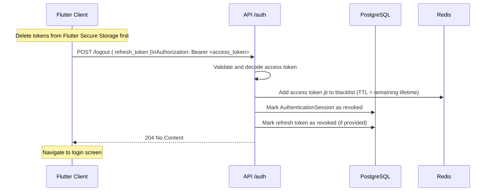
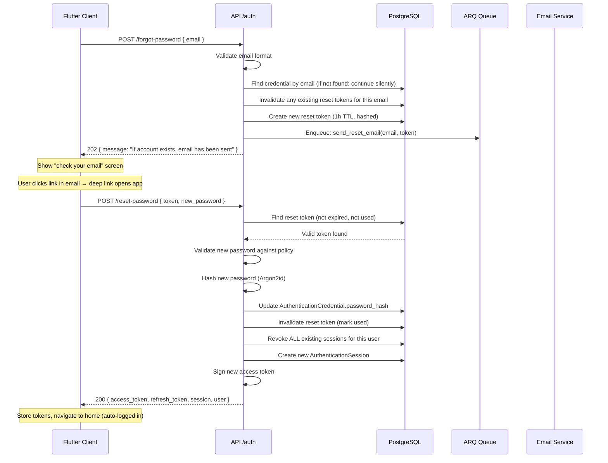

# Authentication API Contract

**Version:** v1
**Base Path:** `/api/v1/auth`
**Last Updated:** 2026-06-26
**Context:** Identity
**Task:** TASK-2.4
**Status:** Contract — not yet implemented

---

## Table of Contents

1. [Overview](#1-overview)
2. [Authentication Strategy](#2-authentication-strategy)
3. [Standard Response Envelope](#3-standard-response-envelope)
4. [Rate Limiting](#4-rate-limiting)
5. [Endpoints](#5-endpoints)
   - [POST /register](#51-post-register)
   - [POST /login](#52-post-login)
   - [POST /refresh](#53-post-refresh)
   - [POST /logout](#54-post-logout)
   - [POST /logout-all](#55-post-logout-all)
   - [POST /change-password](#56-post-change-password)
   - [POST /forgot-password](#57-post-forgot-password)
   - [POST /reset-password](#58-post-reset-password)
   - [POST /verify-email](#59-post-verify-email)
   - [POST /resend-verification](#510-post-resend-verification)
   - [GET /me](#511-get-me)
   - [GET /me/session](#512-get-mesession)
6. [Error Catalogue](#6-error-catalogue)
7. [Security Considerations](#7-security-considerations)
8. [Future Authentication Methods](#8-future-authentication-methods)
9. [Flow Diagrams](#9-flow-diagrams)
10. [OpenAPI Readiness](#10-openapi-readiness)

---

## 1. Overview

The Travix AI Authentication API provides secure, stateful authentication for
mobile clients (Flutter) and future web clients.

**Design goals:**

- Stable contract — v1 endpoints must not change in a breaking way
- Mobile-first — tokens delivered in response bodies for Flutter Secure Storage
- Session-aware — each login creates an auditable session with device metadata
- Refresh token rotation — stolen-token detection via superseded-token reuse detection
- Zero vendor lock-in — no provider-specific concepts in the contract

**Base URL:**

```
https://api.travix.ai/api/v1/auth
```

All paths below are relative to this base.

---

## 2. Authentication Strategy

### 2.1 Token Types

| Token | Format | Lifetime | Storage |
|---|---|---|---|
| Access token | JWT (HS256, future RS256) | 15 minutes | Memory (never persisted on device) |
| Refresh token | Opaque UUID v4 | 7 days | Flutter Secure Storage / httpOnly cookie (web) |

**Access token claims (JWT payload):**

```json
{
  "sub": "b8e3f1a2-...",
  "sid": "c4d7e9f0-...",
  "email": "user@example.com",
  "verified": true,
  "iat": 1719360000,
  "exp": 1719360900,
  "type": "access"
}
```

| Claim | Meaning |
|---|---|
| `sub` | User ID (UUID) — stable across all sessions |
| `sid` | Session ID (UUID) — changes on each login |
| `email` | User's email address at token issuance |
| `verified` | Whether the email is verified at token issuance |
| `iat` | Issued-at (Unix timestamp) |
| `exp` | Expiry (Unix timestamp, `iat + 900`) |
| `type` | Always `"access"` — distinguishes from future token types |

> **Client note:** Clients may decode the JWT to read claims locally. They must
> NOT trust decoded claims as a substitute for backend authorization — always
> validate on the server. Claims are a convenience for UI display only.

### 2.2 Token Lifecycle

```
LOGIN → Access Token (15 min) + Refresh Token (7 days)
             │
             ▼ (access token near expiry)
        POST /refresh → New Access Token + New Refresh Token (rotation)
             │
             ▼ (logout or security event)
        POST /logout → Access Token blacklisted in Redis + Session revoked
```

### 2.3 Refresh Token Rotation

Every call to `POST /refresh`:
1. Validates the submitted refresh token against PostgreSQL.
2. Immediately marks the submitted token as **superseded** (invalidated).
3. Issues a new refresh token.
4. Returns both the new access token and new refresh token.

**Reuse detection:** If a superseded (already-rotated) refresh token is submitted,
the entire token family is invalidated immediately. All sessions for the user are
revoked. This detects stolen refresh tokens.

### 2.4 Token Revocation

| Scenario | Access Token | Refresh Token |
|---|---|---|
| Normal logout | Redis blacklist (`exp` TTL) | Revoked in PostgreSQL |
| Logout all devices | All access tokens blacklisted | All refresh tokens revoked |
| Password change | All OTHER sessions revoked | All other refresh tokens revoked |
| Account disabled | Validated on every request | All refresh tokens revoked |
| Refresh token reuse | Current access token blacklisted | Entire family revoked |

Access tokens are verified against Redis on every authenticated request.
The Redis key is the JWT `jti` (token ID), set with TTL equal to the remaining token lifetime.

### 2.5 Device and Session Awareness

Each login creates an `AuthenticationSession` with:

| Field | Source |
|---|---|
| `session_id` | Generated UUID |
| `device_name` | From `device_info.device_name` in request (optional) |
| `platform` | From `device_info.platform` (optional) |
| `ip_address` | Extracted from request by the API |
| `user_agent` | From `User-Agent` request header |
| `created_at` | Server timestamp |
| `last_active_at` | Updated on every authenticated request |

---

## 3. Standard Response Envelope

All endpoints use a consistent response format.

### 3.1 Success — Single Resource

```json
{
  "data": {
    "field": "value"
  }
}
```

### 3.2 Success — No Content (204)

No body. HTTP 204 is returned for actions with no meaningful response (logout).

### 3.3 Success — Async Operation Accepted (202)

```json
{
  "data": {
    "message": "If an account exists for that email, a password reset link has been sent."
  }
}
```

### 3.4 Authentication Token Response

Returned by: `POST /login`, `POST /refresh`, `POST /reset-password`, and
`POST /verify-email` (when auto-login is enabled).

```json
{
  "data": {
    "access_token": "eyJhbGciOiJIUzI1NiIsInR5cCI6IkpXVCJ9...",
    "refresh_token": "8f14e45f-ceea-467a-a866-051f0ee75a5e",
    "token_type": "Bearer",
    "access_token_expires_at": "2026-06-26T00:15:00Z",
    "refresh_token_expires_at": "2026-07-03T00:00:00Z",
    "session": {
      "session_id": "c4d7e9f0-1b2a-3c4d-5e6f-7a8b9c0d1e2f",
      "device_name": "iPhone 15 Pro",
      "created_at": "2026-06-26T00:00:00Z"
    },
    "user": {
      "user_id": "b8e3f1a2-4c5d-6e7f-8a9b-0c1d2e3f4a5b",
      "email": "user@example.com",
      "is_email_verified": true
    }
  }
}
```

### 3.5 Error Response (RFC 7807 Problem Details)

All errors use RFC 7807 Problem Details extended with a machine-readable `error_code`
and a `trace_id` for log correlation.

```json
{
  "type": "https://errors.travix.ai/auth/invalid-credentials",
  "title": "Invalid Credentials",
  "status": 401,
  "detail": "Email or password is incorrect.",
  "instance": "/api/v1/auth/login",
  "error_code": "AUTH_INVALID_CREDENTIALS",
  "trace_id": "550e8400-e29b-41d4-a716-446655440000"
}
```

| Field | Required | Description |
|---|---|---|
| `type` | Yes | URI that identifies the error type. Dereferenceable (documents the error). |
| `title` | Yes | Short human-readable title. Does not change between occurrences. |
| `status` | Yes | HTTP status code (repeated for body parsing without status-line context). |
| `detail` | Yes | Human-readable explanation of this specific occurrence. |
| `instance` | Yes | The request path that produced the error. |
| `error_code` | Yes | Machine-readable code from the Error Catalogue (Section 6). |
| `trace_id` | Yes | UUID for log correlation. Include in support requests. |

### 3.6 Validation Error Response

Extends RFC 7807 with a field-level `errors` array.

```json
{
  "type": "https://errors.travix.ai/validation-error",
  "title": "Validation Error",
  "status": 422,
  "detail": "One or more fields failed validation.",
  "instance": "/api/v1/auth/register",
  "error_code": "VALIDATION_ERROR",
  "trace_id": "...",
  "errors": [
    {
      "field": "email",
      "error_code": "AUTH_EMAIL_INVALID",
      "message": "Enter a valid email address."
    },
    {
      "field": "password",
      "error_code": "AUTH_PASSWORD_TOO_WEAK",
      "message": "Password does not meet strength requirements.",
      "violations": [
        "Must be at least 12 characters",
        "Must contain at least one uppercase letter",
        "Must contain at least one special character"
      ]
    }
  ]
}
```

### 3.7 Rate Limit Response

```json
{
  "type": "https://errors.travix.ai/auth/rate-limited",
  "title": "Too Many Requests",
  "status": 429,
  "detail": "Too many login attempts. Try again in 47 seconds.",
  "instance": "/api/v1/auth/login",
  "error_code": "AUTH_RATE_LIMITED",
  "trace_id": "...",
  "retry_after_seconds": 47
}
```

**Rate limit headers (on all responses):**

| Header | Description |
|---|---|
| `X-RateLimit-Limit` | Maximum requests allowed in the window |
| `X-RateLimit-Remaining` | Requests remaining in the current window |
| `X-RateLimit-Reset` | Unix timestamp when the window resets |
| `Retry-After` | Seconds until retry is allowed (429 responses only) |

---

## 4. Rate Limiting

| Endpoint | Limit | Window | Key | Scope |
|---|---|---|---|---|
| POST /register | 5 | 1 hour | IP address | Public |
| POST /login | 10 | 5 minutes | Email + IP | Public |
| POST /refresh | 60 | 1 hour | Refresh token family | Per token |
| POST /logout | 30 | 1 hour | User ID | Authenticated |
| POST /logout-all | 5 | 1 hour | User ID | Authenticated |
| POST /change-password | 5 | 1 hour | User ID | Authenticated |
| POST /forgot-password | 3 | 1 hour | Email address | Public |
| POST /reset-password | 5 | 1 hour | IP address | Public |
| POST /verify-email | 10 | 1 hour | IP address | Public |
| POST /resend-verification | 3 | 1 hour | Email address | Public |
| GET /me | 120 | 1 minute | User ID | Authenticated |
| GET /me/session | 120 | 1 minute | User ID | Authenticated |

Account-level lockout (separate from rate limiting): after `max_failed_attempts`
consecutive failed logins for a specific email, the account is locked for
`lockout_duration` (defined by `AuthenticationPolicy`, implementation-level config).

---

## 5. Endpoints

---

### 5.1 POST /register

**Purpose:** Create a new user account with email and password credentials.

**Authentication:** None required (public)

**Rate Limit:** 5 per hour per IP address

**Idempotency:** Not idempotent. Submitting the same email twice returns `AUTH_EMAIL_ALREADY_EXISTS`.

---

#### Request

```http
POST /api/v1/auth/register HTTP/1.1
Content-Type: application/json
```

| Field | Type | Required | Constraints |
|---|---|---|---|
| `email` | string | Yes | Valid email format; max 254 characters; lowercased and stripped by server |
| `password` | string | Yes | 12–128 characters; must meet `PasswordStrengthPolicy` |

**Example:**

```json
{
  "email": "alice@example.com",
  "password": "correct_Horse_Battery_Staple9!"
}
```

---

#### Responses

##### 201 Created

Registration succeeded. `requires_verification` signals whether the user must
verify their email before they can log in.

**When `requires_verification: true` (production default):**

No tokens are issued. The user must verify their email via `POST /verify-email`.

```json
{
  "data": {
    "user_id": "b8e3f1a2-4c5d-6e7f-8a9b-0c1d2e3f4a5b",
    "email": "alice@example.com",
    "requires_verification": true,
    "message": "Please check your email to verify your account before logging in."
  }
}
```

**When `requires_verification: false` (CI / test environments):**

Tokens are issued immediately. The shape is identical to the login response.

```json
{
  "data": {
    "user_id": "b8e3f1a2-4c5d-6e7f-8a9b-0c1d2e3f4a5b",
    "email": "alice@example.com",
    "requires_verification": false,
    "access_token": "eyJhbGciOiJIUzI1NiIsInR5cCI6IkpXVCJ9...",
    "refresh_token": "8f14e45f-ceea-467a-a866-051f0ee75a5e",
    "token_type": "Bearer",
    "access_token_expires_at": "2026-06-26T00:15:00Z",
    "refresh_token_expires_at": "2026-07-03T00:00:00Z",
    "session": {
      "session_id": "c4d7e9f0-1b2a-3c4d-5e6f-7a8b9c0d1e2f",
      "device_name": null,
      "created_at": "2026-06-26T00:00:00Z"
    }
  }
}
```

##### Error Responses

| Status | `error_code` | Trigger |
|---|---|---|
| 409 | `AUTH_EMAIL_ALREADY_EXISTS` | Email is already registered |
| 422 | `AUTH_EMAIL_INVALID` | Email format invalid |
| 422 | `AUTH_PASSWORD_TOO_WEAK` | Password fails strength policy; includes `violations` array |
| 429 | `AUTH_RATE_LIMITED` | Registration rate limit exceeded |

---

#### Notes for Frontend Developers

- Check `requires_verification` before navigating. If `true`, show a "check your
  email" screen. If `false`, navigate to the home screen using the returned tokens.
- The `violations` array in `AUTH_PASSWORD_TOO_WEAK` is a list of human-readable
  strings. Display them as inline form errors.
- Email is normalised server-side (lowercased, stripped). Display the normalised
  value returned in `data.email`, not the value the user typed.
- Do not pre-validate the email format on the client as a business rule — only for
  UX (prevent obviously invalid submissions). The server always re-validates.

---

### 5.2 POST /login

**Purpose:** Authenticate with email and password; receive access and refresh tokens.

**Authentication:** None required (public)

**Rate Limit:** 10 per 5 minutes per email address; 10 per 5 minutes per IP address
(both limits apply independently — the more restrictive triggers first)

**Idempotency:** Not idempotent. Each successful login creates a new session.

---

#### Request

```http
POST /api/v1/auth/login HTTP/1.1
Content-Type: application/json
```

| Field | Type | Required | Constraints |
|---|---|---|---|
| `email` | string | Yes | Valid email format |
| `password` | string | Yes | Plaintext password (sent over TLS) |
| `device_info` | object | No | Device metadata for session display |
| `device_info.device_name` | string | No | Human-readable name; max 100 chars (e.g., "Alice's iPhone 15") |
| `device_info.platform` | string | No | `"ios"` \| `"android"` \| `"web"` |
| `device_info.app_version` | string | No | Semver; max 20 chars (e.g., `"1.2.3"`) |
| `device_info.os_version` | string | No | Max 50 chars (e.g., `"iOS 17.4"`) |

**Example (mobile):**

```json
{
  "email": "alice@example.com",
  "password": "correct_Horse_Battery_Staple9!",
  "device_info": {
    "device_name": "Alice's iPhone 15 Pro",
    "platform": "ios",
    "app_version": "1.0.0",
    "os_version": "iOS 17.4"
  }
}
```

**Example (minimal):**

```json
{
  "email": "alice@example.com",
  "password": "correct_Horse_Battery_Staple9!"
}
```

---

#### Responses

##### 200 OK

```json
{
  "data": {
    "access_token": "eyJhbGciOiJIUzI1NiIsInR5cCI6IkpXVCJ9...",
    "refresh_token": "8f14e45f-ceea-467a-a866-051f0ee75a5e",
    "token_type": "Bearer",
    "access_token_expires_at": "2026-06-26T00:15:00Z",
    "refresh_token_expires_at": "2026-07-03T00:00:00Z",
    "session": {
      "session_id": "c4d7e9f0-1b2a-3c4d-5e6f-7a8b9c0d1e2f",
      "device_name": "Alice's iPhone 15 Pro",
      "created_at": "2026-06-26T00:00:00Z"
    },
    "user": {
      "user_id": "b8e3f1a2-4c5d-6e7f-8a9b-0c1d2e3f4a5b",
      "email": "alice@example.com",
      "is_email_verified": true
    }
  }
}
```

##### Error Responses

| Status | `error_code` | Trigger |
|---|---|---|
| 401 | `AUTH_INVALID_CREDENTIALS` | Wrong email or wrong password (intentionally identical — prevents enumeration) |
| 403 | `AUTH_ACCOUNT_DISABLED` | Account has been deactivated |
| 403 | `AUTH_EMAIL_NOT_VERIFIED` | Email address not yet verified |
| 403 | `AUTH_PASSWORD_EXPIRED` | Password has exceeded maximum age; must be changed |
| 422 | `AUTH_MAX_SESSIONS_EXCEEDED` | User already has the maximum number of concurrent sessions |
| 429 | `AUTH_ACCOUNT_LOCKED` | Account locked due to too many failed login attempts; includes `locked_until` |
| 429 | `AUTH_RATE_LIMITED` | Rate limit exceeded |

**Account locked response (additional fields):**

```json
{
  "type": "https://errors.travix.ai/auth/account-locked",
  "title": "Account Temporarily Locked",
  "status": 429,
  "detail": "Too many failed login attempts. Try again after the lockout period.",
  "error_code": "AUTH_ACCOUNT_LOCKED",
  "locked_until": "2026-06-26T00:30:00Z",
  "retry_after_seconds": 1800
}
```

---

#### Notes for Frontend Developers

- Always use `AUTH_INVALID_CREDENTIALS` for wrong email OR wrong password. Never
  reveal which field is wrong — this prevents account enumeration attacks.
- Store `refresh_token` in Flutter Secure Storage immediately on receipt. Discard
  on app close. Access token lives in memory only.
- Submit `device_info` on every login. This enables users to see named sessions
  ("Alice's iPhone 15") in a future session management screen.
- On `AUTH_PASSWORD_EXPIRED`, redirect to the change-password screen. The user
  can still call `POST /change-password` with their current (expired) password.
- On `AUTH_MAX_SESSIONS_EXCEEDED`, show a dialog asking the user to log out of
  another device first or use `POST /logout-all`.

---

### 5.3 POST /refresh

**Purpose:** Exchange a valid refresh token for a new access token and a new refresh
token. Implements refresh token rotation (the submitted refresh token is immediately
invalidated).

**Authentication:** Valid refresh token (in request body)

**Rate Limit:** 60 per hour per refresh token family

**Idempotency:** Not idempotent. Each call rotates the refresh token.

---

#### Request

```http
POST /api/v1/auth/refresh HTTP/1.1
Content-Type: application/json
```

| Field | Type | Required | Constraints |
|---|---|---|---|
| `refresh_token` | string | Yes | UUID v4 format; previously issued refresh token |

**Example:**

```json
{
  "refresh_token": "8f14e45f-ceea-467a-a866-051f0ee75a5e"
}
```

---

#### Responses

##### 200 OK

The response shape is identical to the login response. The `user` object reflects
the current user state (e.g., updated `is_email_verified`).

```json
{
  "data": {
    "access_token": "eyJhbGciOiJIUzI1NiIsInR5cCI6IkpXVCJ9...",
    "refresh_token": "d4e5f6a7-b8c9-0d1e-2f3a-4b5c6d7e8f9a",
    "token_type": "Bearer",
    "access_token_expires_at": "2026-06-26T01:15:00Z",
    "refresh_token_expires_at": "2026-07-03T00:00:00Z",
    "session": {
      "session_id": "c4d7e9f0-1b2a-3c4d-5e6f-7a8b9c0d1e2f",
      "device_name": "Alice's iPhone 15 Pro",
      "created_at": "2026-06-26T00:00:00Z"
    },
    "user": {
      "user_id": "b8e3f1a2-4c5d-6e7f-8a9b-0c1d2e3f4a5b",
      "email": "alice@example.com",
      "is_email_verified": true
    }
  }
}
```

##### Error Responses

| Status | `error_code` | Trigger |
|---|---|---|
| 401 | `AUTH_REFRESH_TOKEN_INVALID` | Token not found in database |
| 401 | `AUTH_REFRESH_TOKEN_EXPIRED` | Token is older than 7 days |
| 401 | `AUTH_REFRESH_TOKEN_REVOKED` | Token was revoked by logout or security event |
| 401 | `AUTH_REFRESH_REUSED` | A superseded (already-rotated) token was submitted — all sessions for this user have been revoked |
| 401 | `AUTH_SESSION_REVOKED` | The session associated with this token has been revoked |
| 403 | `AUTH_ACCOUNT_DISABLED` | Account has been deactivated since token issuance |
| 429 | `AUTH_RATE_LIMITED` | Refresh rate limit exceeded |

**Stolen token response (AUTH_REFRESH_REUSED):**

```json
{
  "type": "https://errors.travix.ai/auth/refresh-reused",
  "title": "Refresh Token Reuse Detected",
  "status": 401,
  "detail": "A previously used refresh token was submitted. All sessions have been revoked for security. Please log in again.",
  "error_code": "AUTH_REFRESH_REUSED"
}
```

---

#### Notes for Frontend Developers

- **Immediately replace** the stored refresh token with the new one on every
  successful refresh. The old token is now invalid.
- Implement a refresh queue: if multiple requests fire simultaneously when the
  access token is expired, only one should call `/refresh`. The others should wait
  for the result and use the new access token. A concurrent double-refresh will
  produce `AUTH_REFRESH_REUSED`.
- On `AUTH_REFRESH_REUSED`, clear all stored tokens and redirect to the login screen
  with a security message: "Your account was signed in from another location."

---

### 5.4 POST /logout

**Purpose:** Revoke the current session. Invalidates the access token and revokes
the refresh token.

**Authentication:** Required — Bearer access token in `Authorization` header

**Rate Limit:** 30 per hour per user

**Idempotency:** Idempotent. Calling logout on an already-logged-out session has no
visible side effect. The client should treat any non-5xx response as a success.

---

#### Request

```http
POST /api/v1/auth/logout HTTP/1.1
Authorization: Bearer <access_token>
Content-Type: application/json
```

| Field | Type | Required | Constraints |
|---|---|---|---|
| `refresh_token` | string | No | UUID v4; the refresh token to revoke alongside the session |

**Example:**

```json
{
  "refresh_token": "8f14e45f-ceea-467a-a866-051f0ee75a5e"
}
```

**Example (minimal — refresh token not provided):**

```json
{}
```

---

#### Responses

##### 204 No Content

Session revoked. No body.

##### Error Responses

| Status | `error_code` | Trigger |
|---|---|---|
| 401 | `AUTH_TOKEN_MISSING` | No Authorization header |
| 401 | `AUTH_TOKEN_MALFORMED` | Bearer token is not a parseable JWT |
| 401 | `AUTH_TOKEN_INVALID` | JWT signature failed |
| 401 | `AUTH_TOKEN_EXPIRED` | Access token has expired (use refresh token to get a new one, then logout) |
| 429 | `AUTH_RATE_LIMITED` | Rate limit exceeded |

> **Implementation note:** If the access token is expired, the client should first
> call `POST /refresh` to get a new access token, then call `POST /logout`. However,
> the client may choose to skip this and simply clear local tokens — a revoked or
> expired refresh token will be cleaned up by the background session-expiry job.

---

#### Notes for Frontend Developers

- Always include the `refresh_token` in the logout body. This ensures the refresh
  token is immediately invalidated and cannot be used to obtain new access tokens.
- Delete all stored tokens from Flutter Secure Storage BEFORE the API call, then
  call logout. This way, a network failure does not leave the user in a half-logged-out
  state. The session will expire naturally from PostgreSQL.
- Treat any HTTP response (including network errors) as a logout success at the
  client level. Navigate to the login screen regardless.

---

### 5.5 POST /logout-all

**Purpose:** Revoke all active sessions for the current user across all devices.

**Authentication:** Required — Bearer access token

**Rate Limit:** 5 per hour per user

**Idempotency:** Idempotent.

---

#### Request

```http
POST /api/v1/auth/logout-all HTTP/1.1
Authorization: Bearer <access_token>
Content-Type: application/json
```

| Field | Type | Required | Constraints |
|---|---|---|---|
| `current_password` | string | No | If provided, re-verified before revoking (recommended for security) |

**Example:**

```json
{
  "current_password": "correct_Horse_Battery_Staple9!"
}
```

**Example (without password confirmation):**

```json
{}
```

---

#### Responses

##### 204 No Content

All sessions revoked.

##### Error Responses

| Status | `error_code` | Trigger |
|---|---|---|
| 401 | `AUTH_TOKEN_EXPIRED` | Access token expired |
| 401 | `AUTH_WRONG_CURRENT_PASSWORD` | `current_password` provided but incorrect |
| 429 | `AUTH_RATE_LIMITED` | Rate limit exceeded |

---

#### Notes for Frontend Developers

- The current session is also revoked. After calling `/logout-all`, clear all local
  tokens and navigate to the login screen.
- The `current_password` field provides an extra layer of security confirmation.
  Request it from the user before calling this endpoint.

---

### 5.6 POST /change-password

**Purpose:** Change the current user's password. Requires knowing the current password.
All OTHER active sessions are revoked after a successful change. The current session
remains valid.

**Authentication:** Required — Bearer access token

**Rate Limit:** 5 per hour per user

**Idempotency:** Not idempotent.

---

#### Request

```http
POST /api/v1/auth/change-password HTTP/1.1
Authorization: Bearer <access_token>
Content-Type: application/json
```

| Field | Type | Required | Constraints |
|---|---|---|---|
| `current_password` | string | Yes | The user's current password |
| `new_password` | string | Yes | 12–128 characters; must meet `PasswordStrengthPolicy`; must not be a recently used password |

**Example:**

```json
{
  "current_password": "correct_Horse_Battery_Staple9!",
  "new_password": "NewSecurePassphrase_2026#7!"
}
```

---

#### Responses

##### 204 No Content

Password changed. All sessions except the current one have been revoked.

##### Error Responses

| Status | `error_code` | Trigger |
|---|---|---|
| 401 | `AUTH_WRONG_CURRENT_PASSWORD` | `current_password` is incorrect |
| 401 | `AUTH_TOKEN_EXPIRED` | Access token expired |
| 403 | `AUTH_ACCOUNT_DISABLED` | Account is inactive |
| 422 | `AUTH_PASSWORD_TOO_WEAK` | New password fails strength policy; includes `violations` |
| 422 | `AUTH_PASSWORD_REUSE` | New password was recently used |
| 429 | `AUTH_RATE_LIMITED` | Rate limit exceeded |

---

#### Notes for Frontend Developers

- After a successful password change, notify the user that all other devices have
  been signed out. Show the message inline — do not sign the user out of the current
  session.
- Refresh the access token immediately after this call, since the access token's
  `exp` is unchanged but other sessions are gone.
- The `violations` array in `AUTH_PASSWORD_TOO_WEAK` should be displayed as inline
  form errors on the new password field.

---

### 5.7 POST /forgot-password

**Purpose:** Initiate a password reset. Sends a reset link to the provided email
address if an account exists.

**Authentication:** None required (public)

**Rate Limit:** 3 per hour per email address

**Idempotency:** Idempotent within the rate limit window. Multiple calls for the same
email within a short period do NOT send multiple emails — the most recent pending reset
token supersedes any previous ones.

**Enumeration prevention:** Always returns 202 Accepted regardless of whether the
email exists. The client MUST NOT infer account existence from this response.

---

#### Request

```http
POST /api/v1/auth/forgot-password HTTP/1.1
Content-Type: application/json
```

| Field | Type | Required | Constraints |
|---|---|---|---|
| `email` | string | Yes | Valid email format |

**Example:**

```json
{
  "email": "alice@example.com"
}
```

---

#### Responses

##### 202 Accepted

Always returned, even if no account exists for the email.

```json
{
  "data": {
    "message": "If an account exists for that email address, a password reset link has been sent. The link expires in 1 hour."
  }
}
```

##### Error Responses

| Status | `error_code` | Trigger |
|---|---|---|
| 422 | `AUTH_EMAIL_INVALID` | Email format invalid |
| 429 | `AUTH_RATE_LIMITED` | Rate limit exceeded |

---

#### Notes for Frontend Developers

- Display the message verbatim from `data.message`. Do not indicate whether an
  account was found.
- The reset email contains a deep link with the token:
  `travix://reset-password?token=<token>` — handle this in your deep link router.
- After submitting, redirect to a "check your email" screen with a button to resend
  (which calls this endpoint again, subject to rate limits).

---

### 5.8 POST /reset-password

**Purpose:** Complete a password reset using the token from the reset email. Sets
the new password, revokes all existing sessions, and issues new authentication tokens
(auto-login).

**Authentication:** None required (public) — reset token in request body authenticates
the request

**Rate Limit:** 5 per hour per IP address

**Idempotency:** Not idempotent. The token is single-use.

---

#### Request

```http
POST /api/v1/auth/reset-password HTTP/1.1
Content-Type: application/json
```

| Field | Type | Required | Constraints |
|---|---|---|---|
| `token` | string | Yes | Opaque reset token from the password reset email |
| `new_password` | string | Yes | 12–128 characters; must meet `PasswordStrengthPolicy` |

**Example:**

```json
{
  "token": "base64url-encoded-reset-token",
  "new_password": "NewSecurePassphrase_2026#7!"
}
```

---

#### Responses

##### 200 OK

Password reset succeeded. All previous sessions are revoked. Tokens for a new session
are returned.

```json
{
  "data": {
    "access_token": "eyJhbGciOiJIUzI1NiIsInR5cCI6IkpXVCJ9...",
    "refresh_token": "d4e5f6a7-b8c9-0d1e-2f3a-4b5c6d7e8f9a",
    "token_type": "Bearer",
    "access_token_expires_at": "2026-06-26T02:15:00Z",
    "refresh_token_expires_at": "2026-07-03T02:00:00Z",
    "session": {
      "session_id": "e5f6a7b8-c9d0-1e2f-3a4b-5c6d7e8f9a0b",
      "device_name": null,
      "created_at": "2026-06-26T02:00:00Z"
    },
    "user": {
      "user_id": "b8e3f1a2-4c5d-6e7f-8a9b-0c1d2e3f4a5b",
      "email": "alice@example.com",
      "is_email_verified": true
    }
  }
}
```

##### Error Responses

| Status | `error_code` | Trigger |
|---|---|---|
| 401 | `AUTH_RESET_TOKEN_INVALID` | Token not found in database |
| 401 | `AUTH_RESET_TOKEN_EXPIRED` | Token is older than 1 hour |
| 401 | `AUTH_RESET_TOKEN_USED` | Token was already used |
| 422 | `AUTH_PASSWORD_TOO_WEAK` | New password fails policy; includes `violations` |
| 422 | `AUTH_PASSWORD_REUSE` | New password matches a recently used password |
| 429 | `AUTH_RATE_LIMITED` | Rate limit exceeded |

---

#### Notes for Frontend Developers

- Extract the `token` from the deep link query parameter:
  `travix://reset-password?token=<value>`
- On success, store the returned tokens (same as a login response) and navigate
  to the home screen. The user is now logged in.
- Display the `violations` list inline on the password field for `AUTH_PASSWORD_TOO_WEAK`.
- On `AUTH_RESET_TOKEN_EXPIRED`, redirect to the forgot-password screen with a message:
  "The reset link has expired. Request a new one."

---

### 5.9 POST /verify-email

**Purpose:** Verify an email address using the token from the verification email.
On success, issues authentication tokens (auto-login).

**Authentication:** None required (public) — verification token in request body

**Rate Limit:** 10 per hour per IP address

**Idempotency:** Idempotent. Calling with an already-verified token or already-verified
email returns `AUTH_VERIFICATION_ALREADY_COMPLETE` (409).

---

#### Request

```http
POST /api/v1/auth/verify-email HTTP/1.1
Content-Type: application/json
```

| Field | Type | Required | Constraints |
|---|---|---|---|
| `token` | string | Yes | Opaque verification token from the verification email |

**Example:**

```json
{
  "token": "base64url-encoded-verification-token"
}
```

---

#### Responses

##### 200 OK

Email verified. Tokens are issued for immediate login.

```json
{
  "data": {
    "access_token": "eyJhbGciOiJIUzI1NiIsInR5cCI6IkpXVCJ9...",
    "refresh_token": "f5a6b7c8-d9e0-1f2a-3b4c-5d6e7f8a9b0c",
    "token_type": "Bearer",
    "access_token_expires_at": "2026-06-26T00:15:00Z",
    "refresh_token_expires_at": "2026-07-03T00:00:00Z",
    "session": {
      "session_id": "a1b2c3d4-e5f6-7a8b-9c0d-1e2f3a4b5c6d",
      "device_name": null,
      "created_at": "2026-06-26T00:00:00Z"
    },
    "user": {
      "user_id": "b8e3f1a2-4c5d-6e7f-8a9b-0c1d2e3f4a5b",
      "email": "alice@example.com",
      "is_email_verified": true
    }
  }
}
```

##### Error Responses

| Status | `error_code` | Trigger |
|---|---|---|
| 401 | `AUTH_VERIFICATION_TOKEN_INVALID` | Token not found in database |
| 401 | `AUTH_VERIFICATION_TOKEN_EXPIRED` | Token is older than 24 hours |
| 409 | `AUTH_VERIFICATION_ALREADY_COMPLETE` | Email is already verified |
| 429 | `AUTH_RATE_LIMITED` | Rate limit exceeded |

---

#### Notes for Frontend Developers

- Extract the token from the deep link:
  `travix://verify-email?token=<value>`
- On success, store the returned tokens and navigate to the home screen. No
  separate login is needed.
- On `AUTH_VERIFICATION_ALREADY_COMPLETE`, navigate to the login screen with a
  message: "Your email is already verified. Please log in."

---

### 5.10 POST /resend-verification

**Purpose:** Resend the email verification link to the current user.

**Authentication:** None required (public — email provided in body)

**Rate Limit:** 3 per hour per email address

**Idempotency:** Idempotent within rate limit window. Multiple calls invalidate the
previous verification token and issue a new one (only the latest token is valid).

**Enumeration prevention:** Always returns 202 Accepted regardless of whether the
email exists or is already verified.

---

#### Request

```http
POST /api/v1/auth/resend-verification HTTP/1.1
Content-Type: application/json
```

| Field | Type | Required | Constraints |
|---|---|---|---|
| `email` | string | Yes | Valid email format |

**Example:**

```json
{
  "email": "alice@example.com"
}
```

---

#### Responses

##### 202 Accepted

Always returned.

```json
{
  "data": {
    "message": "If an unverified account exists for that email, a new verification link has been sent. The link expires in 24 hours."
  }
}
```

##### Error Responses

| Status | `error_code` | Trigger |
|---|---|---|
| 422 | `AUTH_EMAIL_INVALID` | Email format invalid |
| 429 | `AUTH_RATE_LIMITED` | Rate limit exceeded |

---

#### Notes for Frontend Developers

- Show the "check your email" screen immediately on 202 — do not change the UI based
  on the response body (it is always the same).
- Allow the user to resend once per minute from the UI (enforce client-side), even
  though the server rate limit is 3 per hour. Client-side throttle improves UX.

---

### 5.11 GET /me

**Purpose:** Return the authenticated user's identity and account status.

**Authentication:** Required — Bearer access token

**Rate Limit:** 120 per minute per user

---

#### Request

```http
GET /api/v1/auth/me HTTP/1.1
Authorization: Bearer <access_token>
```

No request body.

---

#### Responses

##### 200 OK

```json
{
  "data": {
    "user_id": "b8e3f1a2-4c5d-6e7f-8a9b-0c1d2e3f4a5b",
    "email": "alice@example.com",
    "is_email_verified": true,
    "is_active": true,
    "password_changed_at": "2026-06-20T14:30:00Z",
    "last_login_at": "2026-06-26T00:00:00Z",
    "active_sessions_count": 2,
    "created_at": "2026-01-15T10:00:00Z"
  }
}
```

| Field | Description |
|---|---|
| `user_id` | Stable UUID for this user |
| `email` | Normalised (lowercase) email address |
| `is_email_verified` | Whether the email has been verified |
| `is_active` | Whether the account is active |
| `password_changed_at` | ISO 8601 timestamp of last password change; null if never set |
| `last_login_at` | ISO 8601 timestamp of most recent successful login |
| `active_sessions_count` | Count of currently active sessions (all devices) |
| `created_at` | ISO 8601 timestamp when the account was created |

##### Error Responses

| Status | `error_code` | Trigger |
|---|---|---|
| 401 | `AUTH_TOKEN_MISSING` | No Authorization header |
| 401 | `AUTH_TOKEN_EXPIRED` | Access token expired |
| 401 | `AUTH_TOKEN_INVALID` | JWT signature invalid |
| 401 | `AUTH_TOKEN_REVOKED` | Token is in the revocation blacklist |

---

#### Notes for Frontend Developers

- Call this endpoint once on app launch (after restoring tokens from storage) to
  hydrate the auth state.
- Cache the response in memory; do not cache to disk. Treat it as valid until the
  access token expires.
- `active_sessions_count > 1` can be surfaced to the user: "You are logged in on
  2 devices."
- This endpoint returns auth-context data only. Full user profile (name, preferences,
  avatar) is at `GET /api/v1/users/me` (Users module — separate endpoint).

---

### 5.12 GET /me/session

**Purpose:** Return details about the current session (the one identified by the
access token being used for this request).

**Authentication:** Required — Bearer access token

**Rate Limit:** 120 per minute per user

---

#### Request

```http
GET /api/v1/auth/me/session HTTP/1.1
Authorization: Bearer <access_token>
```

No request body.

---

#### Responses

##### 200 OK

```json
{
  "data": {
    "session_id": "c4d7e9f0-1b2a-3c4d-5e6f-7a8b9c0d1e2f",
    "device_name": "Alice's iPhone 15 Pro",
    "platform": "ios",
    "ip_address": "203.0.113.42",
    "user_agent": "TravixApp/1.0.0 (iOS 17.4; iPhone15,3)",
    "created_at": "2026-06-26T00:00:00Z",
    "last_active_at": "2026-06-26T00:05:00Z",
    "expires_at": "2026-07-03T00:00:00Z"
  }
}
```

| Field | Description |
|---|---|
| `session_id` | UUID identifying this session |
| `device_name` | User-provided device name (null if not provided at login) |
| `platform` | `"ios"` \| `"android"` \| `"web"` \| null |
| `ip_address` | IP address at login (may differ from current IP) |
| `user_agent` | User-Agent header at login |
| `created_at` | When this session was created |
| `last_active_at` | When this session last made an authenticated request |
| `expires_at` | When the refresh token for this session expires |

##### Error Responses

Same as `GET /me`.

---

---

## 6. Error Catalogue

Complete catalogue of all authentication error codes.

| `error_code` | HTTP Status | Title | Detail |
|---|---|---|---|
| `AUTH_EMAIL_INVALID` | 422 | Email Invalid | The email address format is not valid. |
| `AUTH_EMAIL_ALREADY_EXISTS` | 409 | Email Already Exists | An account with this email address already exists. |
| `AUTH_PASSWORD_TOO_WEAK` | 422 | Password Too Weak | The password does not meet strength requirements. Response includes `violations` array. |
| `AUTH_PASSWORD_REUSE` | 422 | Password Recently Used | This password has been used recently. Choose a different one. |
| `AUTH_PASSWORD_EXPIRED` | 403 | Password Expired | Your password has expired and must be changed before you can continue. |
| `AUTH_INVALID_CREDENTIALS` | 401 | Invalid Credentials | Email or password is incorrect. (Used for both wrong email and wrong password — intentional.) |
| `AUTH_WRONG_CURRENT_PASSWORD` | 401 | Wrong Current Password | The current password provided is incorrect. |
| `AUTH_ACCOUNT_DISABLED` | 403 | Account Disabled | This account has been disabled. Contact support. |
| `AUTH_ACCOUNT_LOCKED` | 429 | Account Locked | Too many failed login attempts. Response includes `locked_until` and `retry_after_seconds`. |
| `AUTH_EMAIL_NOT_VERIFIED` | 403 | Email Not Verified | You must verify your email address before logging in. |
| `AUTH_TOKEN_MISSING` | 401 | Token Missing | No Authorization header was provided. |
| `AUTH_TOKEN_MALFORMED` | 401 | Token Malformed | The Bearer token could not be parsed as a JWT. |
| `AUTH_TOKEN_INVALID` | 401 | Token Invalid | The JWT signature is invalid or the token was tampered with. |
| `AUTH_TOKEN_EXPIRED` | 401 | Token Expired | The access token has expired. Use the refresh token to obtain a new one. |
| `AUTH_TOKEN_REVOKED` | 401 | Token Revoked | This token has been revoked (e.g., via logout). |
| `AUTH_REFRESH_TOKEN_INVALID` | 401 | Refresh Token Invalid | The refresh token was not found. |
| `AUTH_REFRESH_TOKEN_EXPIRED` | 401 | Refresh Token Expired | The refresh token has expired. Please log in again. |
| `AUTH_REFRESH_TOKEN_REVOKED` | 401 | Refresh Token Revoked | This refresh token has been revoked. |
| `AUTH_REFRESH_REUSED` | 401 | Refresh Token Reuse Detected | A previously used refresh token was submitted. All sessions have been revoked as a security precaution. |
| `AUTH_SESSION_NOT_FOUND` | 401 | Session Not Found | The session associated with this token no longer exists. |
| `AUTH_SESSION_EXPIRED` | 401 | Session Expired | This session has expired. |
| `AUTH_SESSION_REVOKED` | 401 | Session Revoked | This session has been revoked (e.g., logout from another device). |
| `AUTH_MAX_SESSIONS_EXCEEDED` | 422 | Max Sessions Exceeded | You have reached the maximum number of concurrent sessions. Log out of another device first. |
| `AUTH_RESET_TOKEN_INVALID` | 401 | Reset Token Invalid | The password reset token was not found or is invalid. |
| `AUTH_RESET_TOKEN_EXPIRED` | 401 | Reset Token Expired | The password reset link has expired. Links are valid for 1 hour. |
| `AUTH_RESET_TOKEN_USED` | 401 | Reset Token Already Used | This reset link has already been used. Request a new one if needed. |
| `AUTH_VERIFICATION_TOKEN_INVALID` | 401 | Verification Token Invalid | The email verification token is invalid or not found. |
| `AUTH_VERIFICATION_TOKEN_EXPIRED` | 401 | Verification Token Expired | The verification link has expired. Links are valid for 24 hours. |
| `AUTH_VERIFICATION_ALREADY_COMPLETE` | 409 | Already Verified | This email address is already verified. |
| `AUTH_RATE_LIMITED` | 429 | Too Many Requests | Rate limit exceeded. Response includes `retry_after_seconds`. |
| `VALIDATION_ERROR` | 422 | Validation Error | One or more fields failed validation. See `errors` array for details. |

### Error Type URIs

All error type URIs follow the pattern:
`https://errors.travix.ai/auth/<kebab-case-code>`

Example: `AUTH_RESET_TOKEN_EXPIRED` →
`https://errors.travix.ai/auth/reset-token-expired`

These URIs will be dereferenceable to a documentation page describing the error,
its causes, and remediation steps.

---

## 7. Security Considerations

### 7.1 HTTPS Enforcement

All API traffic must be over HTTPS. HTTP connections must be redirected to HTTPS.
Certificates must be valid and renewed before expiry. HSTS is enabled.

### 7.2 Token Storage — Mobile (Flutter)

| Token | Storage | Rationale |
|---|---|---|
| Access token | In-memory only (never persisted) | 15-minute lifetime; memory cleared on app backgrounding |
| Refresh token | Flutter Secure Storage | Backed by Android Keystore / iOS Secure Enclave |

**Never store tokens in:**
- `SharedPreferences` (unencrypted)
- Drift/SQLite database (unencrypted)
- Logs or analytics events
- Clipboard

### 7.3 Token Storage — Web (Future)

| Token | Storage | Rationale |
|---|---|---|
| Access token | In-memory (JS variable) | XSS-resistant; not accessible from `localStorage` |
| Refresh token | `HttpOnly`, `Secure`, `SameSite=Strict` cookie | XSS-resistant; JavaScript cannot read it |

For web clients, the server sets the refresh token cookie on login and clears it on logout.
The refresh request reads the cookie automatically — no body parameter needed.

### 7.4 CSRF

For mobile clients (Bearer token in Authorization header): CSRF is not applicable.
JavaScript cannot read or set the `Authorization` header cross-origin.

For future web clients using httpOnly cookies: use `SameSite=Strict` or a CSRF token
in the `X-CSRF-Token` header to prevent cross-site request forgery.

### 7.5 Replay Attack Prevention

| Attack | Mitigation |
|---|---|
| Replaying an access token after expiry | `exp` claim enforced; 15-minute window |
| Replaying an access token before expiry | Redis blacklist checked on every request |
| Replaying a refresh token | Refresh token rotation: each token is single-use |
| Replaying a reset token | Single-use; invalidated immediately on use |
| Replaying a verification token | Single-use; invalidated immediately on use |

### 7.6 Timing Attacks

- Password verification uses Argon2id (constant-time) — see ADR-004.
- All error responses for login return identical JSON regardless of whether the email
  exists or the password is wrong. Response timing is equalized at the service layer.

### 7.7 Enumeration Prevention

| Endpoint | Strategy |
|---|---|
| `POST /login` | `AUTH_INVALID_CREDENTIALS` for both wrong email and wrong password |
| `POST /forgot-password` | Always returns 202 |
| `POST /resend-verification` | Always returns 202 |
| Registration timing | Password hashing runs regardless of whether the email exists |

### 7.8 Account Lockout

After `max_failed_attempts` consecutive failed logins (configured via
`AuthenticationPolicy.max_failed_attempts`), the account is locked for
`AuthenticationPolicy.lockout_duration`. The `locked_until` timestamp is returned
in the `AUTH_ACCOUNT_LOCKED` error response.

### 7.9 Secrets and Key Management

- JWT signing key: `JWT_SECRET_KEY` environment variable; never in source code.
- Refresh tokens: stored as SHA-256 hashes in PostgreSQL. Raw tokens never persisted.
- Reset and verification tokens: stored as SHA-256 hashes in PostgreSQL.
- See ADR-003 for JWT algorithm details and the RS256 migration path.

---

## 8. Future Authentication Methods

The contract is designed to coexist with additional authentication methods without
breaking changes to existing endpoints.

### 8.1 Reserved Endpoints (Not Yet Implemented)

The following paths are reserved. Clients must not assume they do not exist.

#### OAuth 2.0 / OIDC

```
GET  /api/v1/auth/oauth/{provider}/authorize
     Returns the OAuth provider's authorization URL for redirect.
     Providers: google, apple, github

POST /api/v1/auth/oauth/{provider}/callback
     Exchange the OAuth authorization code for Travix tokens.
     Same response shape as POST /login.
```

#### Passkeys (WebAuthn)

```
POST /api/v1/auth/passkey/registration/begin
     Start WebAuthn credential registration. Returns challenge.

POST /api/v1/auth/passkey/registration/complete
     Complete credential registration with authenticator response.

POST /api/v1/auth/passkey/authentication/begin
     Start WebAuthn authentication. Returns challenge.

POST /api/v1/auth/passkey/authentication/complete
     Complete authentication. Returns same token shape as POST /login.
```

#### Magic Links

```
POST /api/v1/auth/magic-link/request
     Send a one-time login link to the email address.
     Same enumeration protection as /forgot-password.

POST /api/v1/auth/magic-link/verify
     Exchange magic link token for auth tokens.
     Same response shape as POST /login.
```

#### JWKS (for RS256 migration — see ADR-003)

```
GET  /api/v1/auth/.well-known/jwks.json
     Exposes public keys for JWT verification.
     Implemented when migrating from HS256 to RS256.
```

### 8.2 Backward Compatibility Promise

When future authentication methods are added:

1. **Existing endpoints do not change.** `POST /login` continues to accept
   email + password.
2. **Token response shape is stable.** All authentication methods return the same
   `access_token`, `refresh_token`, `token_type`, `access_token_expires_at`,
   `refresh_token_expires_at`, `session`, `user` structure.
3. **Error codes are additive.** New error codes may be added. Existing codes are
   never removed or renamed.
4. **New endpoints use new paths.** OAuth uses `/auth/oauth/...`, Passkeys use
   `/auth/passkey/...`. Nothing at existing paths changes.

---

## 9. Flow Diagrams

### 9.1 Registration with Email Verification

```mermaid
sequenceDiagram
    participant C as Flutter Client
    participant A as API /auth
    participant DB as PostgreSQL
    participant Q as ARQ Queue
    participant E as Email Service

    C->>A: POST /register { email, password }
    A->>A: Validate email format + password policy
    A->>DB: Check email not already registered
    DB-->>A: OK (not found)
    A->>A: Hash password (Argon2id)
    A->>DB: Create AuthenticationCredential (unverified)
    A->>DB: Create email verification token (24h TTL)
    A->>Q: Enqueue: send_verification_email(email, token)
    Q-->>A: Job accepted
    A-->>C: 201 { user_id, email, requires_verification: true }

    Note over C: Show "check your email" screen

    C->>A: POST /verify-email { token }
    A->>DB: Find + validate token (not expired, not used)
    DB-->>A: Token valid
    A->>DB: Mark email as verified; invalidate token
    A->>DB: Create AuthenticationSession
    A-->>C: 200 { access_token, refresh_token, session, user }

    Note over C: Store refresh_token in Flutter Secure Storage
    Note over C: Navigate to home screen
```

### 9.2 Login



### 9.3 Token Refresh with Reuse Detection



### 9.4 Logout



### 9.5 Password Reset



---

## 10. OpenAPI Readiness

This contract is designed for straightforward OpenAPI 3.1 specification generation.

### 10.1 Reusable Schemas

The following Pydantic models generate directly to OpenAPI schema components:

| Schema Name | Endpoint(s) | Description |
|---|---|---|
| `RegisterRequest` | POST /register | Email + password |
| `LoginRequest` | POST /login | Email + password + optional device_info |
| `DeviceInfo` | POST /login | Optional device metadata |
| `RefreshRequest` | POST /refresh | Refresh token |
| `LogoutRequest` | POST /logout | Optional refresh token |
| `LogoutAllRequest` | POST /logout-all | Optional current password |
| `ChangePasswordRequest` | POST /change-password | Current + new password |
| `ForgotPasswordRequest` | POST /forgot-password | Email |
| `ResetPasswordRequest` | POST /reset-password | Reset token + new password |
| `VerifyEmailRequest` | POST /verify-email | Verification token |
| `ResendVerificationRequest` | POST /resend-verification | Email |
| `AuthTokenResponse` | POST /login, /refresh, /reset-password, /verify-email | Full token response |
| `RegisterResponse` | POST /register | User ID + email + requires_verification + optional tokens |
| `SessionResponse` | GET /me/session | Session details |
| `MeResponse` | GET /me | Auth-context user data |
| `AsyncAcceptedResponse` | POST /forgot-password, /resend-verification | Generic 202 message |
| `ProblemDetail` | All errors | RFC 7807 base |
| `ValidationProblemDetail` | 422 errors | RFC 7807 + errors array |
| `FieldError` | Nested in ValidationProblemDetail | Per-field error |

### 10.2 Security Schemes

```yaml
securitySchemes:
  BearerAuth:
    type: http
    scheme: bearer
    bearerFormat: JWT
    description: >
      Short-lived JWT access token (15 minutes).
      Obtain from POST /login or POST /refresh.
```

### 10.3 Response Code Summary

| Code | Meaning | Used when |
|---|---|---|
| 200 | OK | Successful GET or successful POST that returns data |
| 201 | Created | POST /register |
| 202 | Accepted | Async operations (forgot-password, resend-verification) |
| 204 | No Content | Logout, logout-all, change-password |
| 400 | Bad Request | Malformed request body (not JSON) |
| 401 | Unauthorized | Auth/token failures |
| 403 | Forbidden | Account state prevents action |
| 409 | Conflict | Duplicate resource |
| 422 | Unprocessable Entity | Validation failures |
| 429 | Too Many Requests | Rate limiting or account lockout |
| 500 | Internal Server Error | Unexpected server error |
| 503 | Service Unavailable | Infrastructure failure (hashing error, DB down) |

### 10.4 Global Response Headers

All responses include:

| Header | Description |
|---|---|
| `Content-Type` | `application/json; charset=utf-8` |
| `X-Request-ID` | UUID for log correlation (mirrors `trace_id` in error body) |
| `X-RateLimit-Limit` | Requests allowed in window |
| `X-RateLimit-Remaining` | Requests remaining |
| `X-RateLimit-Reset` | Unix timestamp of window reset |

---

*End of Authentication API Contract v1*
