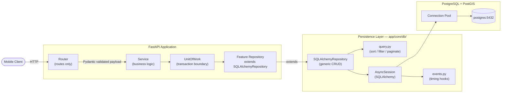
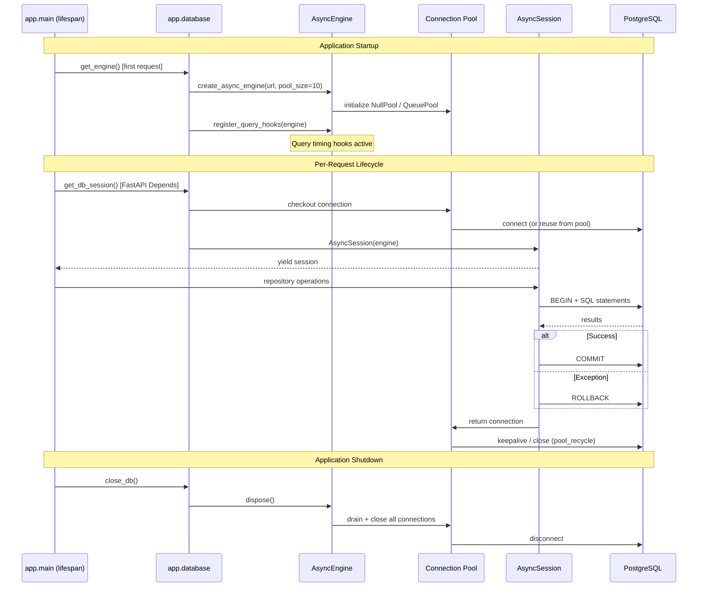

# Database Architecture

**Last updated:** 2026-06-26
**Owner:** Platform Engineering

---

## Overview

Travix AI uses PostgreSQL 16 with PostGIS as its primary data store.
The persistence layer is built on SQLAlchemy 2.0 (async) with Alembic for migrations.
All database interactions are asynchronous via the `asyncpg` driver.

No synchronous database calls exist in the application code. Alembic migrations
use a separate synchronous URL (`psycopg2`) because Alembic's migration runner
is synchronous by design.

---

## Persistence Flow

Shows how a request flows from the HTTP layer through the application to the database:



---

## Database Lifecycle

Shows engine, session factory, and session lifecycle:



---

## Migration Workflow

```mermaid
flowchart TD
    A[Developer changes ORM model] --> B[Add model import to migrations/env.py]
    B --> C["alembic revision --autogenerate -m 'description'"]
    C --> D{Review generated DDL}
    D -->|Has issues| E[Edit migration manually]
    D -->|Looks correct| F[Work through migration checklist]
    E --> F
    F --> G["alembic upgrade head (local)"]
    G --> H{Schema correct?}
    H -->|No| I[New migration to fix it]
    I --> G
    H -->|Yes| J["alembic downgrade -1 (test rollback)"]
    J --> K{Downgrade clean?}
    K -->|No| L[Fix downgrade() function]
    L --> J
    K -->|Yes| M[Commit migration to repository]
    M --> N[CI runs alembic check]
    N --> O{Schema matches models?}
    O -->|No| P[Fail CI — missing migration]
    O -->|Yes| Q[PR ready for review]
    Q --> R[Deploy to staging]
    R --> S["alembic upgrade head (staging)"]
    S --> T[Verify staging schema]
    T --> U[Deploy to production]
```

---

## Schema Conventions

All tables follow these conventions (enforced via mixins in `app/core/db/mixins.py`):

| Column       | Type                       | Source              | Required       |
|---|---|---|---|
| `id`         | UUID v4, PK                | `UUIDPrimaryKeyMixin` | All tables     |
| `created_at` | TIMESTAMPTZ, server default | `TimestampMixin`    | All tables     |
| `updated_at` | TIMESTAMPTZ, auto-update   | `TimestampMixin`    | All tables     |
| `deleted_at` | TIMESTAMPTZ, nullable      | `SoftDeleteMixin`   | User-facing entities |
| `version`    | INTEGER, default 1         | `OptimisticLockMixin` | High-contention entities |

```sql
-- All user-facing entities follow this pattern
CREATE TABLE trips (
    id          UUID PRIMARY KEY DEFAULT gen_random_uuid(),
    created_at  TIMESTAMPTZ NOT NULL DEFAULT NOW(),
    updated_at  TIMESTAMPTZ NOT NULL DEFAULT NOW(),
    deleted_at  TIMESTAMPTZ,           -- NULL = active, non-NULL = soft-deleted
    -- ... domain columns
);

-- updated_at trigger (required for non-ORM updates)
CREATE TRIGGER trg_trips_updated_at
BEFORE UPDATE ON trips
FOR EACH ROW EXECUTE FUNCTION set_updated_at();

-- Soft-delete index (WHERE deleted_at IS NULL)
CREATE INDEX ix_trips_deleted_at ON trips (deleted_at);
```

---

## Naming Conventions

Managed automatically by SQLAlchemy's `MetaData(naming_convention=...)`:

| Constraint type     | Pattern                                               | Example                          |
|---|---|---|
| Index               | `ix_%(column_0_label)s`                               | `ix_trips_created_at`            |
| Unique constraint   | `uq_%(table_name)s_%(column_0_name)s`                 | `uq_users_email`                 |
| Check constraint    | `ck_%(table_name)s_%(constraint_name)s`               | `ck_trips_status`                |
| Foreign key         | `fk_%(table_name)s_%(column_0_name)s_%(referred_table_name)s` | `fk_trips_owner_id_users` |
| Primary key         | `pk_%(table_name)s`                                   | `pk_trips`                       |
| PostGIS GiST index  | `gix_<table>_<column>` (manual)                       | `gix_destinations_coordinates`   |

---

## Connection Pooling

| Setting                        | Default | Environment variable              | Notes                               |
|---|---|---|---|
| `pool_size`                    | 10      | `DB_POOL_SIZE`                    | Persistent connections per process  |
| `max_overflow`                 | 20      | `DB_MAX_OVERFLOW`                 | Burst connections above pool_size   |
| `pool_timeout`                 | 30 s    | `DB_POOL_TIMEOUT`                 | Wait time before connection error   |
| `pool_recycle`                 | 3600 s  | `DB_POOL_RECYCLE`                 | Max connection age before recreation|
| `pool_pre_ping`                | true    | `DB_POOL_PRE_PING`                | SELECT 1 before checkout            |
| `db_slow_query_threshold_ms`  | 200 ms  | `DB_SLOW_QUERY_THRESHOLD_MS`      | WARNING log threshold               |

Pool sizing guideline:
- Total connections = processes × (pool_size + max_overflow)
- With 4 uvicorn workers: 4 × (10 + 20) = 120 max connections
- PostgreSQL default `max_connections` = 100 — adjust before scaling horizontally

---

## Query Monitoring

Query timing is implemented via SQLAlchemy `before_cursor_execute` /
`after_cursor_execute` events attached to `engine.sync_engine`. No external
SDK is required.

Log output:
- Queries under threshold: `DEBUG` level, suppressed in production
- Queries at or above threshold: `WARNING` level with statement preview

Configure the threshold via `DB_SLOW_QUERY_THRESHOLD_MS` (default 200 ms).

---

## Test Strategy

Integration tests use a real PostgreSQL instance (Docker Compose).

Per-test isolation uses the **outer transaction rollback** pattern:
1. A connection is checked out from the engine.
2. An outer transaction is started (`BEGIN`).
3. An `AsyncSession` is bound to this connection.
4. The test runs — any `flush()` writes within the outer transaction.
5. After the test, the outer transaction is rolled back unconditionally.
6. The connection is returned to the pool.

This means all test data is discarded after each test without truncating tables,
making tests fast and fully isolated.

See `tests/conftest.py` for the `db_session` and `db_engine` fixtures.
See `tests/helpers/db.py` for assertion helpers (`count_rows`, `exists_by_id`, etc.).

---

## Module Reference

| Module | Location | Purpose |
|---|---|---|
| Engine + Base + session DI | `app/database.py` | Core SQLAlchemy setup |
| Column mixins | `app/core/db/mixins.py` | UUID PK, timestamps, soft-delete, optimistic lock |
| Generic repository | `app/core/db/repository.py` | `SQLAlchemyRepository[E, IDT]` |
| Unit of Work | `app/core/db/unit_of_work.py` | `UnitOfWork` Protocol + `SQLAlchemyUnitOfWork` |
| Query helpers | `app/core/db/query.py` | Sort, filter, spec bridge, cursor pagination |
| Event hooks | `app/core/db/events.py` | Query timing + slow query logging |
| Test fixtures | `tests/conftest.py` | `db_engine`, `db_session`, `uow_factory` |
| Test helpers | `tests/helpers/db.py` | `count_rows`, `exists_by_id`, `RepositoryTestCase` |
| Migrations | `migrations/` | Alembic migration files |
