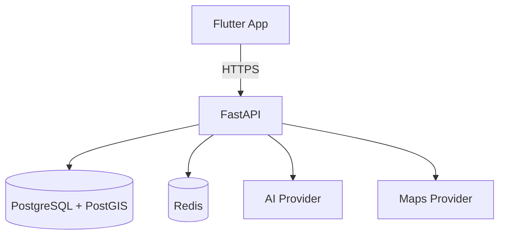

# docs/diagrams/ — System Diagrams

This folder contains **visual system diagrams** for Travix AI — architecture diagrams,
data flow diagrams, entity relationship diagrams, and sequence diagrams.

---

## Purpose

Diagrams communicate system structure and behavior faster than prose. This folder is the
canonical location for all visual documentation of the Travix AI system.

---

## Diagram Types

| Type | Tool | File Format | Purpose |
|---|---|---|---|
| Architecture overview | draw.io or Mermaid | `.drawio` / `.md` | System-level component diagram |
| Data flow | Mermaid | `.md` | How data moves through the system |
| Sequence diagrams | Mermaid | `.md` | Request/response flows (auth, AI, etc.) |
| Entity relationships | Mermaid or dbdiagram.io | `.md` / `.dbml` | Database schema relationships |
| Deployment | draw.io | `.drawio` | Infrastructure and deployment topology |

---

## Preferred Format

**Mermaid** is the preferred format for most diagrams because:
- It lives in markdown — versioned alongside the code
- GitHub renders it natively in markdown files
- No proprietary tooling required

For complex visual diagrams, use draw.io and export as both `.drawio` (editable) and `.svg`
(renderable in docs).

---

## Mermaid Example

````markdown

````

---

## File Naming Convention

```
{type}-{short-description}.{ext}
```

Examples:
- `arch-system-overview.md`
- `seq-auth-refresh-token.md`
- `erd-trip-planning.md`
- `flow-ai-trip-generation.md`

---

## Status

> No diagrams created yet. Diagrams will be added as each system component is documented.
