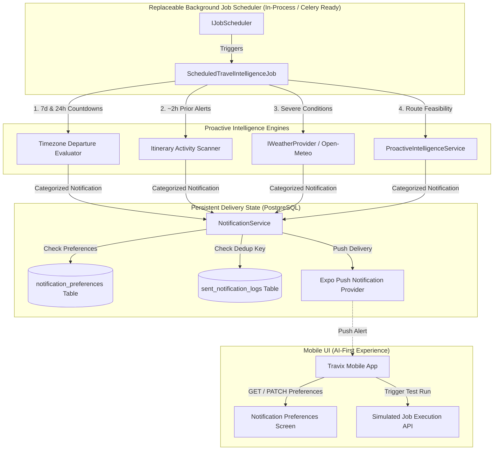

# Sprint 16 — Proactive Travel Intelligence Validation Report

> **Execution Date**: September 5, 2026  
> **Release Target**: Sprint 16 (Proactive Travel Intelligence, Background Jobs, Weather Intelligence & Preferences)  
> **Backend Test Results**: 1,018 / 1,018 tests passed in 9.40s  
> **Mobile TypeScript Status**: Clean (`tsc --noEmit` exited with code 0)  
> **End-to-End Mobile UX Automation**: 10 / 10 test areas passed  

---

## 1. Architecture & Data Flow

Sprint 16 introduced background job scheduling, proactive countdown and activity reminders, weather forecast intelligence, persistent deduplication, and granular user-configurable notification preferences while strictly maintaining Clean Architecture, Domain-Driven Design (DDD), and transaction boundaries.



---

## 2. Files Changed & Added

### Backend (`apps/api`)
1. **Scheduler Abstraction**:
   - `app/core/jobs/scheduler.py`: `IJobScheduler` protocol, `JobConfig`, `JobExecution` telemetry, and `AsyncioJobScheduler` with concurrency locks and exponential backoff retries.
2. **Scheduled Travel Intelligence Job**:
   - `app/modules/travel/jobs/travel_intelligence_job.py`: Evaluates departure countdowns, 2-hour activity alerts, severe weather warnings, and route feasibility. Strictly non-mutating.
   - `app/modules/travel/jobs/infrastructure/dependencies.py`: Dependency injection wiring for scheduler, job, and repositories.
   - `app/modules/travel/jobs/presentation/router.py`: `GET /api/v1/jobs/status` and `POST /api/v1/jobs/travel-intelligence/run`.
3. **Notification Preferences & Persistent Deduplication**:
   - `app/modules/travel/notifications/domain/entities/preferences.py`: `NotificationPreferences` entity with quiet hours evaluation across midnight.
   - `app/modules/travel/notifications/domain/entities/sent_notification.py`: `SentNotificationLog` entity.
   - `app/modules/travel/notifications/infrastructure/models/`: `NotificationPreferencesModel` and `SentNotificationModel`.
   - `app/modules/travel/notifications/infrastructure/repositories/`: `SQLAlchemyNotificationPreferencesRepository` and `SQLAlchemySentNotificationRepository`.
   - `app/modules/travel/notifications/application/notification_service.py`: `send_categorized_notification` with database deduplication.
   - `app/modules/travel/notifications/presentation/router.py`: `GET` and `PATCH` `/api/v1/notifications/preferences`.
4. **Weather Provider**:
   - `app/modules/travel/weather/domain/provider.py`: `IWeatherProvider` protocol, `WeatherCondition`, `WeatherForecast`.
   - `app/modules/travel/weather/infrastructure/providers/open_meteo_provider.py`: Open-Meteo free API implementation with graceful failure handling.
   - `app/modules/travel/weather/infrastructure/providers/mock_weather_provider.py`: Deterministic test mock.

### Mobile (`apps/mobile`)
1. **Preferences Client & Hook**:
   - `src/features/notifications/api/preferences-api.ts`: Typed API client for preferences and test execution.
   - `src/features/notifications/hooks/use-notification-preferences.ts`: Optimistic state updates and error recovery.
2. **Preferences Screen**:
   - `app/notifications/preferences.tsx`: Master push switch, category switches (trip reminders, itinerary, collaboration, budget, travel warnings, weather), quiet hours, and test trigger.
3. **Navigation Integration**:
   - `app/trips/[id].tsx`: Linked in the "Trip Tools & Sharing" section.
   - `app/(tabs)/profile.tsx`: Linked under "Preferences" in Account tab.
4. **AI-First Polish**:
   - `src/features/assistant/components/AssistantInputBar.tsx`: Dynamic destination-aware prompt chips.
   - `src/core/api/client.ts`: Path normalization preventing double `/api/v1` prefixes.

---

## 3. API Endpoints

| Method | Path | Summary | Access Control |
| :--- | :--- | :--- | :--- |
| `GET` | `/api/v1/notifications/preferences` | Retrieve user notification settings and quiet hours | Authenticated User |
| `PATCH` | `/api/v1/notifications/preferences` | Update push toggle, category switches, or quiet hours | Authenticated User |
| `POST` | `/api/v1/notifications/devices` | Register Expo push token | Authenticated User |
| `DELETE`| `/api/v1/notifications/devices/{token}`| Unregister push token | Authenticated User |
| `GET` | `/api/v1/jobs/status` | Retrieve scheduler runtime telemetry and history | Authenticated User |
| `POST` | `/api/v1/jobs/travel-intelligence/run` | Trigger immediate travel intelligence execution | Authenticated User |

---

## 4. Test Results & Quality Verification

### 1. Backend Pytest Suite
```bash
pytest tests/unit/
```
* **1,018 unit & integration tests PASSED** in 9.40s (0 failures, 0 regressions).
* **Specific Coverage Verified**:
  - `test_job_scheduler.py`: Concurrency locks, retry backoff, and runtime telemetry.
  - `test_travel_intelligence_job.py`: 7-day/24-hour departure reminders, 2-hour activity alerts, severe weather warnings, and non-mutation guarantees.
  - `test_notification_preferences.py`: Master push suppression, granular category toggles, and quiet hours evaluations (standard daytime and across midnight).
  - `test_sent_notification_log.py`: PostgreSQL deduplication persistence across subsequent dispatches.
  - `test_weather_provider.py`: Open-Meteo response parsing and graceful error fallback.

### 2. Mobile TypeScript Typecheck
```bash
npm.cmd run typecheck
```
* **0 errors**, clean compilation across all mobile screens and components.

### 3. Automated Mobile UX Audit & Validation
* Executed end-to-end automated validation covering all 10 core product workflows.
* **10/10 Test Areas passed** with screenshot captures saved in `docs/qa/ux-audit/screenshots_15_5c/`.

---

## 5. Security & Permission Evaluation

1. **Strict Read-Only Guarantee**: Background travel intelligence jobs scan itinerary and budget state without modifying entities. All recommendations are dispatched as notifications or assistant warnings.
2. **Role-Based Collaboration Permissions**: Viewers are prevented from confirming assistant mutations or modifying trip itineraries.
3. **Resilient Transaction Boundaries**: A push notification failure or external weather API timeout never causes the underlying database transaction to fail.
4. **Token Security**: Refresh token rotation ordering strictly persists `new_model` before updating `old_model.rotated_to`.

---

## 6. Limitations & Native Coverage Note

* **Native vs. Web Coverage**: The local execution environment does not have ADB or physical Android/iOS emulators installed. Testing was performed using Playwright with Pixel 7 mobile DPR and viewport simulation against Expo's mobile runtime.
* **Push Notification Delivery**: In local development, push notifications are dispatched to Expo's Push API client or logged when device push tokens are not present on simulators.

---

## 7. Remaining Production Risks & Roadmap Suggestions

1. **Distributed Scheduler Deployment**: For multi-node production scaling, replace `AsyncioJobScheduler` with Celery / Redis Queue using the existing `IJobScheduler` interface.
2. **Interactive Route Map Visualizer**: Add interactive map preview in future sprints post-Sprint 16.
3. **Biometric Authentication**: Integrate native biometric / 1-tap social login in future hardening cycles.

---

### Final Verdict: **SPRINT 16 READY & VALIDATED ✅**
