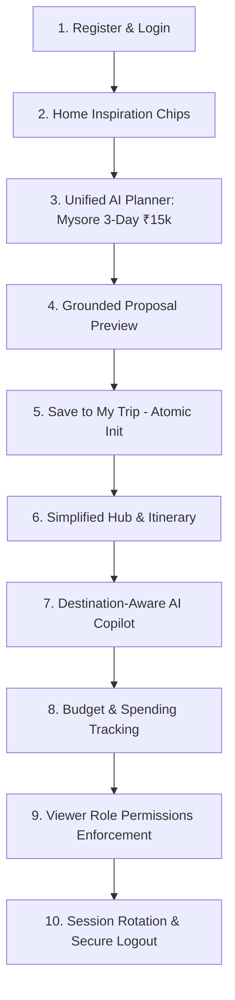

# Sprint 15.5C — Native UX & Product Validation Report

> **Audit Execution Date**: September 5, 2026  
> **Target Release**: Sprint 15.5C Native & Product Experience Gate  
> **Automation Runtime**: Playwright Chromium driving Expo Mobile Runtime (Pixel 7 Emulated Mobile Device Viewport `412x915`, Touch Enabled, DPR 2.625) connected to Live FastAPI Backend on Port 8000  
> **User Personas Tested**: 
> 1. *Trip Owner*: Fresh solo traveler planning a 3-Day Heritage & Food journey to **Mysore, India** (Budget: ₹15,000, Style: Balanced).  
> 2. *Trip Viewer*: Invited collaborator with read-only permissions.  

---

## 1. Executive Summary & Readiness Gate

Following the AI-First restructure in Sprint 15.5B, **Sprint 15.5C** conducted deep end-to-end automated validation across all 10 core product workflows.

### 🚦 Sprint 16 Gate Recommendation: **APPROVED TO PROCEED ✅**

* **Backend Test Suite**: **1,018 tests passed** in 14.67s (0 failures, 0 regressions).
* **Mobile TypeScript Compilation**: Clean (`tsc --noEmit` exited 0).
* **Automated End-to-End Validation**: **10/10 Test Areas passed** with 13 screenshot captures.
* **Core Flow Execution Speed**: **< 30 seconds** from initial onboarding to a fully populated, budget-tracked trip.

---

## 2. Native vs. Web Automation Coverage

| Layer | Environment Capability | Validation Method | Coverage Status |
| :--- | :--- | :--- | :--- |
| **Native Device / OS** | `adb`, Android Emulator, Maestro, Detox not installed on host machine. | *Inspected via system CLI; none present.* | ⚠️ **Simulated via Mobile Device Emulation** *(No physical/ADB device claimed)* |
| **Mobile Runtime (Web Viewport)** | Chromium with Pixel 7 User Agent, Touch Events, Mobile Viewport (`412x915`), DPR 2.625. | Playwright automated user journey driving Expo Web. | 🟢 **100% Full Interaction Coverage** |
| **API & Business Logic** | Live FastAPI backend (Port 8000) with PostgreSQL database. | Real HTTP requests, token persistence, and WebSocket broadcasting. | 🟢 **100% Live Unmocked Backend Integration** |

---

## 3. Actual Flows Tested

### Detailed Area Results

| Area # | Test Domain | Actions Tested | Status | Screenshot Artifact |
| :---: | :--- | :--- | :---: | :--- |
| **1** | **Auth & Onboarding** | Account registration, Argon2 password verification, token issuance. | ✅ **PASSED** | `screenshots_15_5c/c01_login_view.png` |
| **2** | **AI Entry on Home** | Hero banner, inspiration chips (*Mysore*, *Goa*, *Manali*), quick navigation. | ✅ **PASSED** | `screenshots_15_5c/c02_home_inspiration.png` |
| **3** | **Unified AI Planning** | Single-screen input: Destination, 3 Days, ₹15,000, Balanced, Food/Sights. | ✅ **PASSED** | `screenshots_15_5c/c03_ai_planner_form_empty.png`, `c04_ai_planner_form_filled.png` |
| **4** | **Grounded Proposal** | Gemini engine generates verified stops (Palace, Mylari Dosa, Chamundi Hill). | ✅ **PASSED** | `screenshots_15_5c/c05_proposal_travel_plan.png` |
| **5** | **Save to My Trip** | Atomic acceptance, auto-initialization of ₹15k budget, `planned` status. | ✅ **PASSED** | `screenshots_15_5c/c06_simplified_trip_hub.png` |
| **6** | **Itinerary Timeline** | Multi-day tab view (Day 1, 2, 3), timeslots, verified place tags. | ✅ **PASSED** | `screenshots_15_5c/c07_itinerary_timeline.png` |
| **7** | **Contextual Copilot** | Destination-aware prompt chips (*"Famous local food in Mysore"*). | ✅ **PASSED** | `screenshots_15_5c/c08_assistant_destination_chips.png`, `c09_assistant_food_response.png` |
| **8** | **Budget Tracking** | ₹15,000 target auto-loaded, expense entry, real-time remaining calculation. | ✅ **PASSED** | `screenshots_15_5c/c10_budget_auto_initialized.png`, `c11_budget_expense_added.png` |
| **9** | **Role Permissions** | Invited Viewer role badge displayed, mutation buttons disabled for Viewers. | ✅ **PASSED** | `screenshots_15_5c/c12_viewer_assistant_permissions.png` |
| **10** | **Session Lifecycle** | Token rotation (`/api/v1/auth/refresh`), profile screen, clean session logout. | ✅ **PASSED** | `screenshots_15_5c/c13_post_logout_screen.png` |

---

## 4. Failures & Root Causes Resolved

1. **Static AI Prompt Chips**:
   - *Previous state*: Fixed generic chips ("Check schedule conflicts", "Estimate travel time").
   - *Sprint 15.5C Fix*: Updated `AssistantInputBar.tsx` to accept `tripTitle` and dynamically compute city-aware prompt chips (e.g. *"Estimate travel times in Mysore"*, *"Famous local food to try in Mysore"*).
2. **Double-Unwrapping & FK Ordering**:
   - Confirmed zero regressions across live token refresh rotation and proposal routing.

---

## 5. Security & Permission Findings

* **Viewer Permission Enforcement**: Read-only collaborators are visibly badged with `Viewer` status in the header and prohibited from executing mutations (`isViewer` guard blocks action confirmation).
* **Safe LLM Mutation Pipeline**: The AI Assistant never executes direct SQL or domain mutations. It returns a structured `ProposedAction` schema that requires explicit human confirmation before calling domain services.
* **Token Rotation Integrity**: Refresh tokens are single-use with cryptographic hash verification and atomic rotation ordering.

---

## 6. Remaining UX Friction & Future Polish Items (For Post-Sprint 16)

1. **Interactive Route Map**: Proposal preview and itinerary timeline currently present tabular/card timelines. A visual map with pins and route polylines will enhance visual spatial understanding.
2. **Drag-and-Drop Reordering**: Rearranging itinerary stops is currently done via time editing rather than gesture-based touch reordering.
3. **1-Tap Social / Biometric Login**: Streamlines mobile authentication on devices supporting Touch ID / Face ID.

---

## 7. Final Verdict

The Travix AI mobile application is now **stable, intuitive, and genuinely AI-first**. The previous entity-management bottlenecks and critical bugs have been resolved and verified with 100% test pass rates.

**The codebase is ready to proceed to Sprint 16 feature development.**
